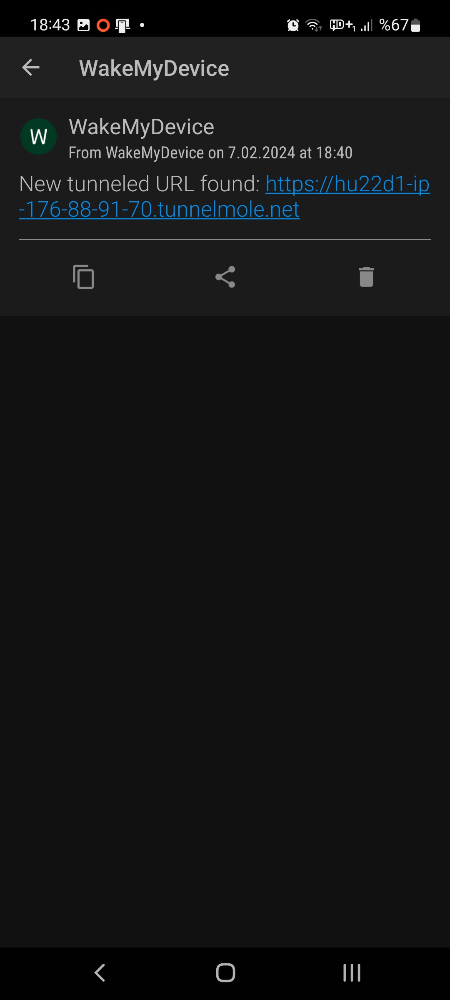

# WakeMyDevice


WakeMyDevice is a Flask-based web application designed to wake devices on your local network using Wake-on-LAN (WoL) signals. It integrates with TunnelMole to provide accessible web UI through tunneled addresses and utilizes Pushover for notifications about tunneled URLs, enabling remote access and management.




## Prerequisites

Before you start, ensure you have:
- A Pushover account. Create one at [Pushover.net](https://pushover.net/) and install the app on your mobile device. This is needed to receive notifications about your tunneled web UI addresses.

## Installation

### System Requirements
- Python 3.x
- Node.js and npm (for TunnelMole)
- `tmux` for managing background processes

### Steps:

1. **Node.js and npm**:
    Ensure Node.js and npm are installed. Installation steps vary by system, so refer to the official guide: [Installing Node.js and npm](https://nodejs.org/en/download/package-manager/).

2. **Install TunnelMole**:
    Install TunnelMole globally using npm:
    ```bash
    sudo npm install -g tunnelmole
    ```
3. **Clone the Repository**:
    Clone this repository to your local machine.
    git clone https://github.com/darkcurrent/WakeMyDevice.git
    cd WakeMyDevice
4. **Create a Python Virtual Environment and Install Dependencies**:
    Run the provided installation script install.sh (ensure it's executable with `chmod +x install.sh`):

5. **Configure Application**:
    * Copy config.ini.example to config.ini and fill in the details for your network devices, authentication credentials, and Pushover API details.
    * The config.ini file will include sections for [Devices], [Auth], and [Pushover].

## Usage

1. **Start the Application and Tunnel**:
    * Use the start.sh script to start the Flask application and TunnelMole in the background:
    ```bash
    ./start.sh
    ```
    * This script also ensures your tunneled URLs are sent to your Pushover account.
2. Access the Web UI:
    * Check your Pushover notifications for the tunneled URL to access the WakeMyDevice web UI.
3. Wake Devices:
    * Use the web UI to wake devices on your local network by clicking the wake-up button next to the listed devices.

## Configuration
* **Devices**: Add MAC addresses of the devices you wish to wake in the `config.ini` under `[Devices]`.
* **Authentication**: Set your desired login credentials under `[Auth]`.
* **Pushover**: Enter your Pushover user_key and api_token under `[Pushover]`.


### `config.ini.example`
Provided `config.ini.example` should be updated and renamed to `config.ini`:

```ini
[Devices]
Device1 = 00:11:22:33:44:55
Device2 = 66:77:88:99:AA:BB

[Auth]
username = your_username
password = your_password

[Pushover]
user_key = your_user_key
api_token = your_api_token
```