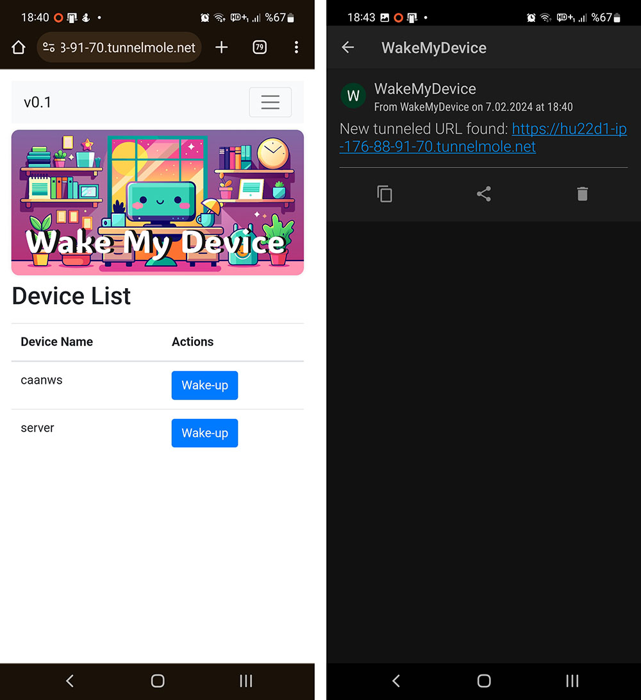

# WakeMyDevice


WakeMyDevice is a Flask-based web application designed to wake devices on your local network using Wake-on-LAN (WoL) signals. This project offers flexibility in remote access methods: through a web UI accessible via a TunnelMole tunnel and MQTT for environments where direct web access is not feasible.



## Prerequisites

Before starting, ensure you have:
- A Pushover account for receiving notifications. Create one at [Pushover.net](https://pushover.net/).

## Why TunnelMole Instead of Cloudflare Tunnel?

I chose TunnelMole over Cloudflare Tunnel due to the latter's lack of support for ARM7 architecture, which is common in single-board computers like OrangePi Zero or RaspberryPi 3. This decision ensures compatibility with a wide range of hardware, especially for simple applications like WakeMyDevice.

## Limitations of TunnelMole's Free Version

TunnelMole's free version does not persistently store the generated URLs. To have continuous access to tunneled URLs, a paid subscription is necessary. This limitation led to the inclusion of MQTT as an alternative remote access method.

## Direct Access via Port Forwarding

Users in regions that allow port forwarding might not require TunnelMole or MQTT for remote access. They can directly open their web servers to the internet. However, in some countries, ISPs may restrict port forwarding, making it challenging to reach web servers without tunneling.

## Introduction to MQTT

For those needing an alternative due to the limitations of TunnelMole or port forwarding restrictions, MQTT provides a viable solution. I've integrated MQTT functionality to offer another layer of accessibility to WakeMyDevice.

### Setting Up a Free MQTT Account with HiveMQ

1. Visit [HiveMQ](https://www.hivemq.com/) and sign up for a free account.
2. Create an MQTT instance, noting the server, port, username, and password.
3. Update the `config.ini` with these MQTT details under the `[MQTT]` section.
4. You can use an app for sending the MAC addresses using an app like [IoT MQTT Panel](https://play.google.com/store/apps/details?id=snr.lab.iotmqttpanel.prod&hl=en_US). Setup a connection and a button which will send the MAC Address to the provided topic. All should be provided in the config.ini file.


## Installation

### System Requirements
- Python 3.x
- Node.js and npm (for TunnelMole, optional)
- `tmux` for managing background processes

### Steps

1. **Install Node.js and npm**: Follow [Installing Node.js and npm](https://nodejs.org/en/download/package-manager/).
2. **Install TunnelMole** (optional):
   ```bash
   sudo npm install -g tunnelmole
   ```
3. **Clone the Repository**:
   ```bash
   git clone https://github.com/darkcurrent/WakeMyDevice.git
   cd WakeMyDevice
   ```
4. **Setup Environment and Dependencies**:
   Run `install.sh` after making it executable with `chmod +x install.sh`.

5. **Configure Application**:
   Copy `config.ini.example` to `config.ini` and fill in your details.

## Usage

1. **Start the Application**: Use `start.sh` for TunnelMole or configure MQTT in `config.ini`.
2. **Access the Web UI** (if using TunnelMole): Check Pushover for the URL.
3. **Access MQTT Panel** (if using MQTT)
3. **Wake Devices**: Via the web UI or custom MQTT dashborads.

## Configuration

Update `config.ini` for devices, authentication, Pushover, and MQTT settings. Rename the `config.ini.example` file.